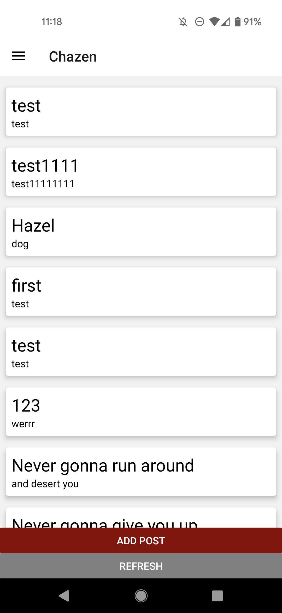
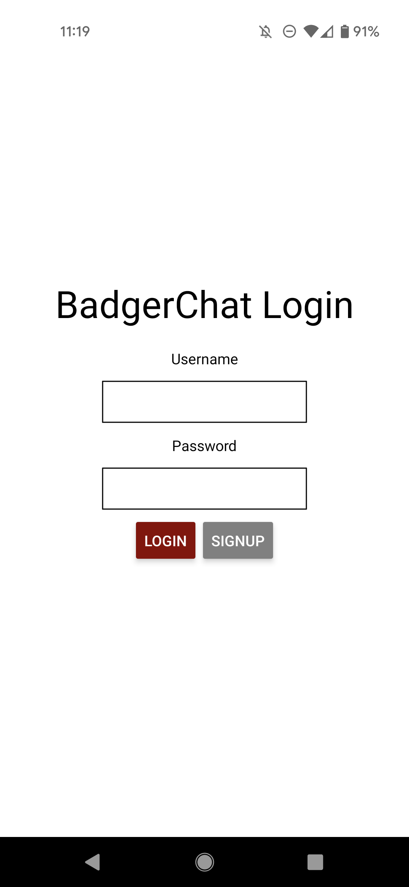
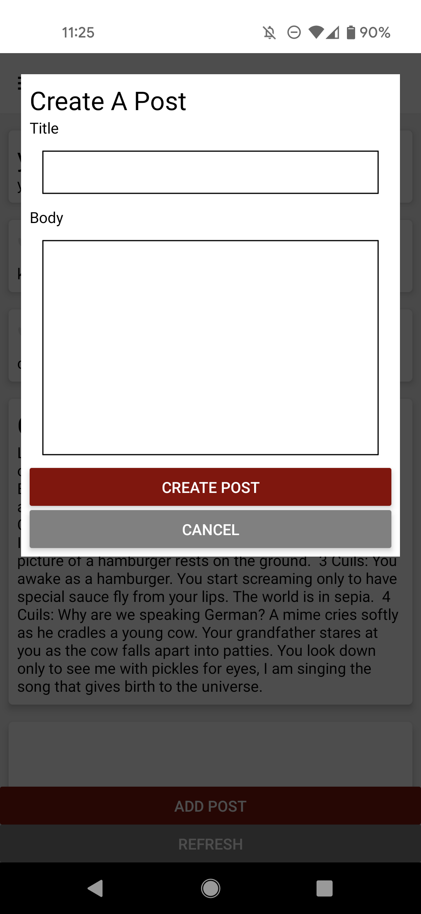
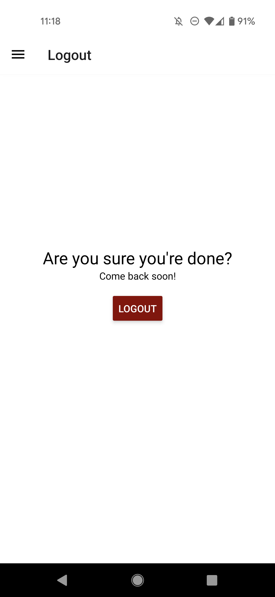

# CS571 HW8: BadgerChat

Welcome back to BadgerChat! For this assignment, you will re-implement BadgerChat as *a mobile application*. Following, you will improve your application's accessibility. **This will require you to go back and modify your code**! Make sure to complete both parts of this assignment.



## BadgerChat

The starter code provided to you was generated using [expo](https://expo.dev/) and all the necessary libraries for [react navigation](https://reactnavigation.org/) and [expo-secure-store](https://www.npmjs.com/package/expo-secure-store) have already been added. See the `package.json` for details. **You should *not* re-run the expo init command**. Instead, in this directory, simply run...

```bash
npm install
npm start
```

To test your app, you have a few options. If you have a smart device, I would recommend using the expo app for [iOS](https://apps.apple.com/us/app/expo-go/id982107779) or [Android](https://play.google.com/store/apps/details?id=host.exp.exponent&hl=en_US&gl=US). You can scan the QR code using your phone, or you can launch commands via the terminal. Otherwise, you can use an emulator (such as [AVD](https://developer.android.com/studio/run/emulator)). Do not use the web browser to test your code; you must test on Android or iOS!

Note that we are writing code in JavaScript for React Native; if you begin writing code in Objective-C, Swift, Java, or Kotlin you are likely doing something *very* wrong!

### API Notes

All data can be retrieved via API calls to `https://www.coletnelson.us/cs571/f22/hw8/api/`.

 - **This API has the same endpoints as HW5.**
 - **This HW shares the same database as HW5.**

A brief overview of the API is provided below. All routes are relative to `https://www.coletnelson.us/cs571/f22/hw8/api/`

| Method | URL | Purpose | Return Codes |
| --- | --- | --- | --- |
| `GET`| `/chatroom` | Get all chatrooms. | 200, 304 |
| `GET` | `/chatroom/:chatroomName/messages`| Get latest 25 messages for specified chatroom. | 200, 304, 404 |
| `POST` | `/chatroom/:chatroomName/messages` | Posts a message to the specified chatroom. Requires JWT. | 200, 400, 404, 413 |
| `DELETE` | `/chatroom/:chatroomName/messages/:messageId` | Deletes the given message. Requires JWT. | 200, 400, 401, 404 |
| `POST` | `/register` | Registers a user account and returns a JWT. | 200, 400, 401, 409, 413  |
| `POST` | `/login` | Logs a user in, returning a JWT. | 200, 400, 401, 404 |

**When making API calls with a request body, don't forget to include the header `"Content-Type": "application/json"`**


### 1. Login
Provide a login screen that allows the user to login with a username and password. Don't worry about storing the JWT for now; we will revisit this in Step 3. If the user enters an incorrect username or password simply alert them that their login credentials were incorrect.

In addition, add a "Signup" button. **You do not need to implement registration for this homework.** Simply alert the user to use the web app to sign up for an account. As such, to create users to test your app, you will need to use Postman or your solution to HW5.



### 2. Display Chatrooms

After the user has successfully logged in, they should be routed to a landing page. On this landing page, the user should be able to access a drawer that will allow them to navigate to the different chatrooms of BadgerChat. Each chatroom should display the messages for that chatroom as well as the option to add a post or refresh with the latest messages. We will complete adding a post in Step 4.

Remember, you do *not* need a JWT to read the latest messages; this is a public forum. If you get stuck on creating the navigation for multiple chatrooms, I would recommend re-visiting HW5's `BadgerApp.js` for a *similar* example (remember, in React we used `react-router` whereas in React Native we are using `react-navigation`; they are slightly different!).

**You must use React Navigation for this requirement.**


### 3. Store JWT

Remember, JWTs are sensitive data! They are the equivilant of a short-term username and password. Use [expo-secure-store](https://www.npmjs.com/package/expo-secure-store) to store the JWT from Step 1. 

**Note:** `expo-secure-store` is compatible with Android and iOS devices and emulators, but not web!

**You must use Expo Secure Store for this requirement.**

### 4. Create Post

Using the JWT from Step 3, the user should be able to create a post in a particular chatroom. How you choose to do this is up to you! For example, you can simply use another screen or you can use [react-native-modal](https://www.npmjs.com/package//react-native-modal) to complete your [third party library](https://canvas.wisc.edu/courses/324228/assignments/1691946) assignment.

Upon posting, the user should see the *updated* message board. Additionally, you must check that the user has specified a title and body for their post. Alert the user if they forgot to do so.



### 5. Logout

Add a navigation screen to the Drawer for the user to logout. Upon logout, the JWT should be deleted from the secure store and the user should be re-routed to the login screen.



### Other Notes
You do not need to handle user registration or deletion of posts. You do *not* need to prompt the user to re-authenticate upon expiration of the JWT.

You may *not* hardcode the names of the chatrooms *anywhere*!

### Submission Details
In addition to your code, **you will also need to submit a video recording of your app**. Like the demo video, it should cover all the tasks below. Please thoroughly demonstrate all tasks to showcase the capabilities of your app.

**Please embed your recording as a [Kaltura video](https://learning.kaltura.com/media/How+to+Embed+a+Kaltura+Media+in+the+Context+of+a+Canvas+Course/0_4weol2uv) as a part of the assignment submission.**

#### Tasks 
 - Show the signup alert.
 - Show an incorrect login attempt.
 - Show a correct login attempt.
 - Show navigation between atleast 2 chatrooms.
 - Show all messages in a chatroom.
 - Show attempt to add an empty post.
 - Show adding a complete post.
 - Show logging out.

___

## Accessibility

It is important that our apps be universally accessible. Consider the following checklist...

 1. Does each user input element have an appropriate label?
 2. Does each screen provide sufficient color contrast?
 3. Is the text readable for all users? (hint: the example solution may not be!)

In your code, **implement any necessary changes** so that your application is accessible according to these 3 items. Then, comment on how your app meets each of these requirements.

**Does each user input element have an appropriate label?**

INSERT YOUR RESPONSE HERE.

**Does each screen provide sufficient color contrast?**

INSERT YOUR RESPONSE HERE.

**Is the text readable for all users?**

INSERT YOUR RESPONSE HERE.

**Please make meaningful changes and comments.** For example, for Checklist Item #1, the button "Add Post" may be made more accessible by adding a label that announces the context in which it is in, e.g. "Add Post to the Arboretum Chatroom". I would make this change and then comment on how it improves accessibility.

**Bonus:** You can use [iOS's VoiceOver](https://support.apple.com/guide/iphone/turn-on-and-practice-voiceover-iph3e2e415f/ios) or [Android's TalkBack](https://support.google.com/accessibility/android/answer/6283677?hl=en) to test the accessibility of your application!

